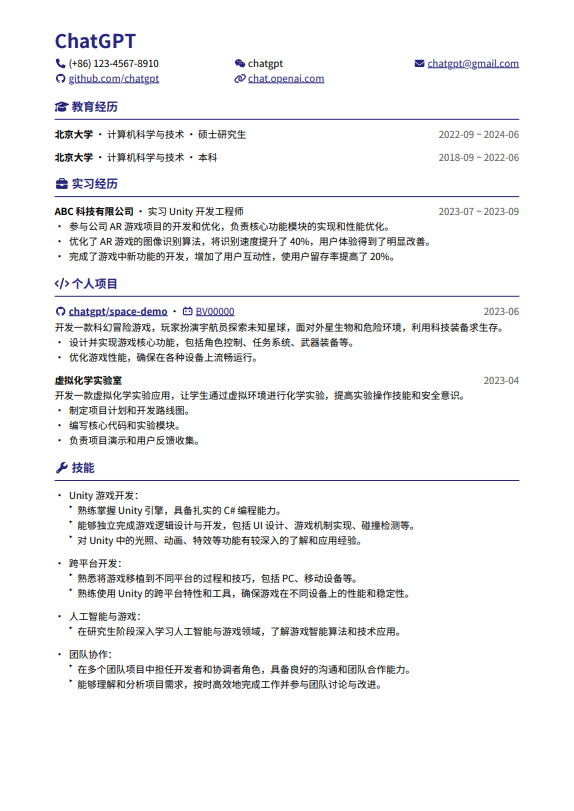
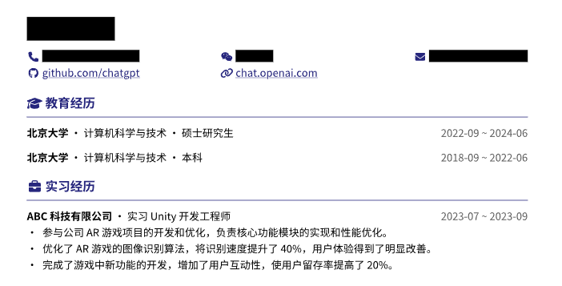

# 简历模板

个人使用的简历模板，使用 [Typst](https://github.com/typst/typst) 编写。

## 样例

内容由 ChatGPT 生成。

- 源文件：[example/resume.typ](example/resume.typ)
- 生成的 PDF：[example/resume.pdf](example/resume.pdf)



## 隐藏隐私信息

在一开始的参数里指定 `anonymous: true`，就能自动隐藏隐私信息。

``` typst
#show: resume.with(
  // ...
  anonymous: true,
)
```



除了上图中被隐藏的信息外，还可以用 `privacy` 函数把一个内容标记为隐私，之后它也会被隐藏。

``` typst
#privacy[
  *不许看!*
]
```

## Font Awesome 图标

模板中内置了一些图标，在 [icons](icons) 文件夹里。

|变量|预览|
|:-:|:-:|
|`fa-bilibili`||
|`fa-code`||
|`fa-envelope`||
|`fa-github`||
|`fa-graduation-cap`||
|`fa-link`||
|`fa-phone`||
|`fa-weixin`||
|`fa-work`||
|`fa-wrench`||

不够用的话可以自己加，然后导入。

``` typst
#let fa-my-icon = svg-icon("icons/fa-my-icon.svg")
```
